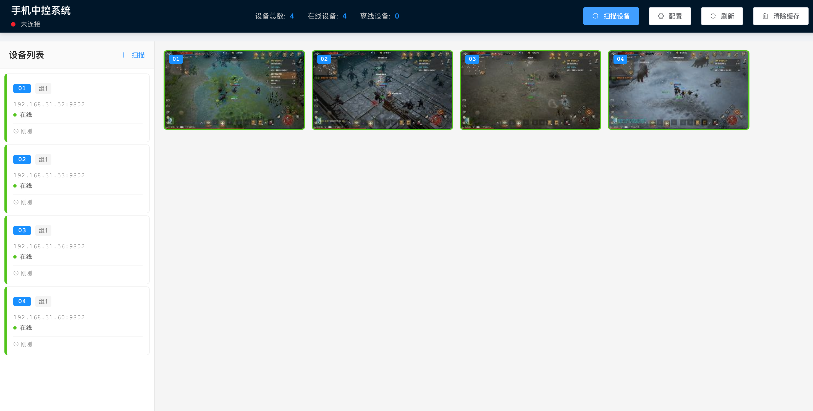

# 主板机 TCP投屏中控系统

一个基于Java SpringBoot + Vue的主板机TCP投屏中控系统，**无需开启开发者模式，无需ADB调试，使用前提是手机装有艾琳框架才可以**，支持局域网设备扫描和实时屏幕画面显示。

声明：仅学习用途，无商业化

> 🤝 **手机端框架**: 未来考虑免艾琳框架，其实只要手机装一个常驻进程和开启自启的tcp服务即可，这样应该能支持任意手机投屏，甚至美版三星都可以

> 💡 **开发进度**: 核心功能用1小时完成，后续功能陆续开发中...  

> 🤝 **欢迎贡献**: 有精力的朋友欢迎来增加功能，一起完善这个项目！...


## 核心优势

### 🚀 **免开发者模式**
- ✅ **无需开启开发者模式** - 告别繁琐的开发者选项设置
- ✅ **无需ADB调试** - 不依赖ADB工具，部署更简单
- ✅ **纯TCP连接** - 基于TCP协议的稳定投屏方案
- ✅ **主板机适配** - 专为主板机等嵌入式设备优化

### 💻 **功能特性**
- 🔍 **前端直接扫描** - 前端直接HTTP请求扫描192.168.31.0-255网段设备
- ⚡ **HTTP快速检测** - 使用HTTP GET请求(/getscreensize)检测设备在线状态  
- 📱 **多屏幕实时显示** - 支持最多20个设备同时显示屏幕画面
- 🎛️ **可配置网络参数** - 支持自定义IP段、检测端口(9801)、投屏端口(9802)
- 💻 **现代化Web界面** - 左侧设备列表，右侧网格显示屏幕
- 🔄 **本地设备缓存** - 扫描结果自动缓存，下次打开快速加载
- 📊 **设备管理** - 设备添加、移除、状态监控、缓存管理

## 系统架构

### 后端技术栈
- Java 1.8
- Spring Boot 2.5.5
- WebSocket (实时通信)
- Socket (屏幕数据获取)

### 前端技术栈
- Vue.js 2.6
- Element UI 2.15
- Vuex (状态管理)
- WebSocket (实时通信)

## 快速开始

### 环境要求

- JDK 1.8+
- Maven 3.6+
- Node.js 14+
- npm/yarn

### 后端启动

1. 编译项目
```bash
mvn clean compile
```

2. 启动后端服务
```bash
mvn spring-boot:run
```

后端服务将在 http://localhost:8080 启动

### 前端启动

1. 进入前端目录
```bash
cd frontend
```

2. 安装依赖
```bash
npm install
```

3. 启动开发服务器
```bash
npm run dev
```

前端服务将在 http://localhost:3000 启动

### 生产环境部署

1. 构建前端
```bash
cd frontend
npm run build
```

2. 打包后端
```bash
mvn clean package
```

3. 运行jar包
```bash
java -jar target/mobile-control-1.0.0.jar
```

## 配置说明

### 网络配置

默认配置在 `src/main/resources/application.yml`:

```yaml
mobile:
  network:
    base-ip: 192.168.31      # 基础IP段
    start-range: 0           # 起始范围
    end-range: 255           # 结束范围
    detect-port: 9801        # HTTP检测端口
    stream-port: 9802        # 投屏数据端口
    connect-timeout: 2000    # Socket连接超时(毫秒)
    http-timeout: 1000       # HTTP请求超时(毫秒)
    max-windows: 20          # 最大窗口数
    batch-size: 10           # 分批扫描大小
```

### 运行时配置

也可以通过Web界面的"网络配置"按钮进行实时配置修改。

## 使用说明

### 设备连接

系统会自动扫描配置的IP范围内的设备，寻找监听9802端口的投屏服务。

**重要**: 此系统专为**主板机TCP投屏**设计，无需在设备上开启开发者模式或ADB调试，只需要设备支持TCP Socket连接即可。

### 主板机投屏服务示例

参考提供的Python代码，在主板机或其他设备上运行投屏服务（无需开启开发者模式）：

```python
import socket

HOST = "192.168.31.60"  # 设备IP
PORT = 9802

s = socket.socket(socket.AF_INET, socket.SOCK_STREAM)
s.connect((HOST, PORT))

buffer = b""
frame_count = 0

while True:
    data = s.recv(4096)
    if not data:
        break
    buffer += data

    # 查找JPEG头尾
    while True:
        start = buffer.find(b'\xff\xd8')  # JPEG文件头
        end = buffer.find(b'\xff\xd9')    # JPEG文件尾
        if start != -1 and end != -1 and end > start:
            jpg = buffer[start:end+2]
            buffer = buffer[end+2:]

            frame_count += 1
            # 处理JPEG帧数据...
        else:
            break
```

### 界面操作

1. **设备扫描** - 点击"扫描设备"按钮，前端直接HTTP扫描局域网设备
2. **设备管理** - 在左侧设备列表中查看和管理设备
3. **屏幕监控** - 右侧网格实时显示各设备屏幕画面
4. **网络配置** - 点击"配置"按钮修改扫描参数
5. **缓存管理** - 点击"清除缓存"按钮清理本地设备缓存

## API接口

### REST API

- `GET /api/mobile/devices` - 获取设备列表
- `GET /api/mobile/devices/{deviceId}` - 获取指定设备信息  
- `DELETE /api/mobile/devices/{deviceId}` - 移除设备
- `POST /api/mobile/config/network` - 更新网络配置
- `GET /api/mobile/status` - 获取系统状态

### 前端扫描机制

前端直接向各IP发起HTTP请求进行设备检测：
```javascript
// 检测设备是否在线
const url = `http://${ip}:9801/getscreensize`
// 如果请求成功（状态码200），说明设备在线
```

### WebSocket API

- `ws://localhost:8080/api/ws/screen` - 实时屏幕数据推送

消息格式：
```json
{
  "type": "frame",
  "deviceId": 1,
  "image": "data:image/jpeg;base64,/9j/4AAQ...",
  "timestamp": 1640995200000
}
```

## 开发说明

### 项目结构

```
ailin-web/
├── src/main/java/com/ailin/mobile/     # 后端源码
│   ├── config/                         # 配置类
│   ├── controller/                     # REST控制器
│   ├── service/                        # 业务服务
│   ├── model/                          # 数据模型
│   └── handler/                        # WebSocket处理器
├── src/main/resources/                 # 资源文件
├── frontend/                           # 前端源码
│   ├── src/
│   │   ├── components/                 # Vue组件
│   │   ├── views/                      # 页面视图
│   │   ├── services/                   # API服务
│   │   └── store/                      # Vuex状态管理
│   └── public/                         # 静态资源
└── pom.xml                             # Maven配置
```

### 添加新功能

1. 后端：在相应的service中添加业务逻辑
2. 前端：在components/views中添加UI组件
3. API：在controller中添加REST接口
4. 实时数据：通过WebSocket推送更新

## 故障排除

### 常见问题

1. **设备扫描不到**
   - 检查设备IP是否在配置范围内
   - 确认设备9802端口服务是否正常运行
   - 检查防火墙设置

2. **屏幕画面不显示**
   - 确认WebSocket连接正常
   - 检查设备是否持续发送JPEG数据
   - 查看浏览器控制台错误信息

3. **连接断开**
   - 检查网络连接稳定性
   - 确认设备投屏服务没有中断

## 开发计划

### ⏱️ 当前进度
- ✅ **核心投屏功能** - 1小时快速开发完成
- ✅ **设备扫描检测** - 局域网自动发现设备
- ✅ **实时画面显示** - WebSocket推送屏幕数据
- ✅ **基础设备管理** - 添加、移除、状态监控

### 🚧 计划功能
- 🔄 设备控制操作（点击、滑动等）
- 📁 录屏功能
- 🖼️ 截图保存
- 📊 性能监控
- 🔧 更多配置选项
- 📱 移动端适配

## 贡献指南

这个项目目前还处于早期阶段，**诚邀有经验的开发者一起完善**！

### 🤝 如何贡献
1. Fork 本项目
2. 创建功能分支 (`git checkout -b feature/AmazingFeature`)
3. 提交更改 (`git commit -m 'Add some AmazingFeature'`)
4. 推送到分支 (`git push origin feature/AmazingFeature`)
5. 开启 Pull Request

### 💡 贡献方向
- 🐛 修复现有bug
- ⚡ 性能优化
- 🎨 UI/UX改进
- 📱 设备兼容性提升
- 🔧 新功能开发
- 📝 文档完善

**欢迎任何形式的贡献！即使是一个小的改进也会让项目更好！**

## 许可证

MIT License
